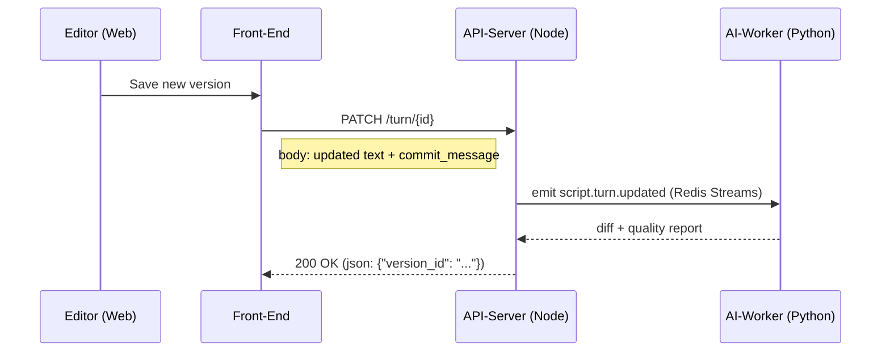

# User Flow 1: Dataset Editing & Version Preservation
<!-- ✅ ideation_collab.md – Dataset Editing & Version Preservation -->

## Goal
Enable data team members (psychologists, reviewers, and the founder) to access imported script datasets, edit individual turns within these scripts non-destructively, and export the latest version, all while ensuring every change creates a new, attributable version. This flow directly replaces the current Google Docs-based editing workflow for dataset management and lays the foundation for future RLHF data creation.

> The initial bulk import of existing datasets from Google Docs (converted to JSON) will be performed once by the Founder. Psychologists and other users will then access these scripts for ongoing edits via a selection mechanism (e.g., by Persona Number/Type and Day Number).

### Note on UI Prototyping Approach
To facilitate rapid visual ideation, especially for a non-designer team, the project may explore using AI image generation models. The intention is not to replace traditional UI/UX design in tools like Figma but to use AI-generated visuals as an inspirational "seed." These seeds can help brainstorm various aesthetics and high-level concepts quickly. These initial ideas would then be taken by the team (or collaborating designers) to be refined and properly structured into functional UI mockups within Figma, ensuring that established UX principles, component design, and interactivity requirements are met. This approach aims to accelerate early-stage visual exploration before detailed design work commences.

## Actors
- Data Team Member (Editor role): Primary content creators and editors, typically psychologists.
- Reviewer: Users (e.g., product people, senior psychologists) responsible for reviewing edits before final approval or export.
- Founder: Has full administrative and editing capabilities, responsible for initial system setup and can perform all editor/reviewer actions.

## Pre-conditions
- A login mechanism is in place, and the user (Editor, Reviewer, or Founder) is logged in.
- The user has appropriate permissions based on their role to access and edit scripts.
- Existing script datasets (originally from Google Docs) have been converted to a predefined JSON format and imported into the system by the Founder.

## User Flow Steps

**1. Data Ingestion (One-time Setup by Founder / As Needed for New Datasets)**
    1.1. **User Action (Founder):** Runs a backend import command (e.g., a management CLI or a one-off admin script) that points to one or more JSON files containing the script data.  This operation is performed outside the normal web UI and is restricted to Founder-role credentials.
    1.2. **System Response:** Launches an asynchronous background job that validates each JSON file and writes the data into the database/DAG.  The command immediately returns a Job ID so progress can be monitored via logs or an admin console.  No web-UI blocking occurs.

**2. Script Selection & Viewing**
    2.1. **User Action:** Navigates to the script selection interface. This interface facilitates a hierarchical drill-down to locate a specific script. The process is as follows:
        *   **Module Selection:** Initially, the canvas displays a high-level view (e.g., "Program" and available Modules). The **Contextual Right-Side Panel (RSP)** prompts the user to "Select a module to begin...". The user clicks on a Module on the canvas.
        *   **Topic Selection:** Upon module selection (e.g., "Module 1: Defusion"), the canvas updates to show Topics within that module. The selected Module is highlighted. The RSP prompts, "Select a topic...". At this stage, the RSP may also present an "Export Module" button, allowing the user to bulk export the entire selected module's content.
        *   **Persona / Script Type Selection:** Upon topic selection (e.g., "Topic 1: Intro"), the canvas highlights the chosen Topic and displays available Persona tags or script types related to it. The RSP prompts, "Select a script to load...".
        *   **Script Confirmation:** Once a Persona/script type is selected (e.g., "Anger"), it's highlighted on the canvas. The full hierarchical path is now defined.

    2.2. **System Response:** Throughout the selection process, the canvas and RSP update to reflect the current level of hierarchy and available choices. The header bar also updates to show the path of the current selection (e.g., "Module 1 /", then "Module 1 / Topic 1 /", then "Module 1 / Topic 1 / Persona X - Anger"). Once a full path to a script is resolved through the hierarchical selection:
        *   The **Contextual Right-Side Panel** displays a prominent "Load script" button.

    2.3. **User Action:** Clicks the "Load script" button in the RSP.
    2.4. **System Response:**
        - Loads the selected script.
        - Renders the "gold path" (the main sequence of turns, initially the only path) on the interactive canvas.
        - Basic canvas navigation features (e.g., pan, zoom) are available as per `ideation_collab.md`.
        - Each turn (node) on the canvas displays its content (rendered from Markdown) and a version badge (e.g., "v1").

**2a. System Enhancement (Smart Resume – "Jump back to where I was")**  
        • **Trigger:** User logs in and has edited at least one script within the last 7 days.  
        • **System Response:** Instead of starting in the hierarchical selector, the application auto-loads the last-opened script, navigates straight to its canvas, and displays a non-blocking toast: "Resumed last script: *Module / Topic / Persona* – click to change."  
        • **Opt-out:** A persistent "Change script" control in the header lets the user dismiss the resume and open the normal selector at any time.  

    **2b. System Enhancement (Auto-focus First Unedited Node)**  
        • **When:** Immediately after a script loads via 2.4 *or* via Smart Resume (2a).  
        • **System Response:** The canvas pans/zooms to the first node in the gold path whose **latest version was *not* created by the current user today**.  
        • **Fallback:** If every node has a same-day version by the current editor, focus the most recently edited node.  
        • **Rationale:** Removes the "where do I start?" decision and saves one click per turn during batch-editing sessions.  

    **2c. Inline Commit Summary Prompt**  
        • **Hook point:** Immediately after the user hits **"Save New Version"** (step 4.2) but before the final confirmation toast.  
        • **UI:** The Right-Side Panel surfaces a single-line text input labelled "Quick summary of what changed (120 chars)".  
        • **Persistence:** The value is saved as `commit_message` metadata on the new version node.  
        • **Surfacing:** The commit message appears alongside the version badge in the timeline and in diff views, giving reviewers instant context without opening the full diff.

**3. Node Interaction & Editing Initiation**

    3.1. **User Action (Node Selection & Initial Context):** Identifies a turn (node) on the canvas that requires viewing or editing and **single-clicks** it.
    3.2. **System Response:**
        - The selected node is visually highlighted on the canvas (e.g., with a color/glow).
        - The canvas view zooms and centers on the selected node at a standard, readable level.
        - The **Contextual Right-Side Panel** opens (if not already open) and displays a "Canvas Node Context View" for the selected node. This view includes:
            - Basic node information (e.g., a snippet of current content, author of current version, current version number).
            - A list of contextually relevant actions, such as:
                - "View Full Details / Version Timeline"
                - "Edit this Version"
                - "Add Comment" (for later user flows)
                - Other actions as defined in `ideation_collab.md` for later flows.

    3.3. **User Action (Optional Shortcut to Full Details / Version Timeline):** Alternatively, the user **double-clicks** a node on the canvas.
    3.4. **System Response (to Double-Click, loading Node Inspector / Version Timeline View):**
        - The selected node is highlighted, and the canvas zooms/centers as in 3.2.
        - The **Contextual Right-Side Panel** opens (if not already open) and directly loads the "Node Inspector / Version Timeline View" for the double-clicked node. This view is structured as follows, based on `ideation_collab.md`:
            - **Pinned Parent Turn:** At the very top of this view, the full text of the immediate *parent turn* (the preceding conversational turn in the script, e.g., if an assistant node is selected, its preceding user turn is shown) is displayed in a fixed, non-scrolling card. This card remains sticky as the user scrolls through the versions below.
            - **Version Display for Selected Node:** Below the pinned parent turn, versions of the *currently selected node* are displayed in chronological order (newest at the top, descending to oldest).
                - This list is presented along a visual "center spine."
                - Version cards alternate on the left and right of this spine.
                - The latest/current version (and any other designated "gold" versions, though for Flow 0.1 the latest is typically the only gold) displays its full text content.
                - Older versions may be represented by more compact cards (e.g., showing metadata and a snippet, expandable on click – details for Pass 2 design), but for Flow 0.1, showing full text for recent versions is prioritized.
            - This view will also serve as the host for detailed metadata, version comparison tools, and other node-specific functionalities in later user flows.

    3.5. **User Action (Initiating Edit):** From the **Contextual Right-Side Panel** (either from the initial "Canvas Node Context View" after a single-click, or from the "Node Inspector / Version Timeline View" after a double-click or navigating there), the user selects an **"Edit this Version"** action/button for the current version of the node.
    3.6. **System Response (Preparing for Edit):**
        - The selected node on the **canvas** transitions into an editable state (e.g., its border changes, a "Draft" badge might appear). The text content of the node becomes directly modifiable on the canvas.
        - The **Contextual Right-Side Panel** transitions to an "Editing State" (see section 3. (d) below), providing contextual editing tools (like formatting, AI suggestions), and "Save New Version" / "Cancel" buttons.
        - The canvas view itself remains interactive, but direct content modification for *other* nodes is temporarily disabled while one node is being actively edited.

**4. Node Content Modification & Version Creation**

    4.1. **User Action:** Modifies the content directly **on the canvas node**. For formatting or advanced actions (like invoking AI suggestions), the user interacts with controls provided in the **Contextual Right-Side Panel**.
    4.2. **User Action:** Explicitly saves or commits the changes (e.g., clicks a "Save New Version" button within the **Contextual Right-Side Panel**, presses Ctrl+S if focus is in an appropriate part of the UI, or the system saves on blur as defined in `ideation_collab.md`).
    4.3. **System Response (Post-Save):**
        - A **new version** of the node is created in the DAG, pointing to the previous version as its parent. This new version is *not* an overwrite.
        - The new version is stamped with:
            - The current editor's profile/ID.
            - The current timestamp.
            - A new version number (e.g., if the previous was "v1", this is "v2").
        - For this initial user flow focused on linear editing of the gold path, the newly created version **automatically becomes the current "gold" version** for that turn. The mechanism for designating other branches/versions as "gold" will be part of a subsequent user flow.
        - The **Contextual Right-Side Panel** updates to display the newly saved version and its information. The version badge/number shown for the node (both on canvas and in the panel) increments.
        - If the panel was showing the version timeline, the new version appears as the latest.
        - A confirmation message (e.g., toast notification "v2 saved by [Editor Name]") is displayed.
        - The previous version (e.g., "v1") remains accessible via the version timeline within the Contextual Right-Side Panel.

**5. Content Rendering**
    5.1. **System Response (Ongoing):** Throughout the viewing and editing process, any node content containing Markdown is rendered appropriately (e.g., italics, bold text, lists, handling of line breaks and emojis) for readability, both on the canvas and in the Node Inspector.

**6. Script Export**
    6.1. **User Action:** From the canvas view of a script, initiates an "Export Script" function.
    6.2. **System Response:**
        - Traverses the "gold path" of the currently viewed script.
        - For each node in the gold path, takes the content of its *latest version*.
        - Constructs a JSON output file containing the sequence of turns from the gold path.
        - The content within the JSON preserves Markdown formatting (e.g., `*italics*`, `**bold**`), line breaks, and emojis as raw strings (e.g., `"text": "This is **bold** and *italic*.\nThis is a new line with 😊."`).
        - Prompts the user to save the generated JSON file.

## Post-conditions
- The edited script now has new versions for the modified nodes, with clear authorship and timestamps.
- All previous versions are preserved and accessible.
- The user can export the latest state of the script's gold path.
- The dataset within Data-Loop is now the source of truth for this script, and future edits will occur here, not in Google Docs.

## Key Success Metrics for this Flow
- Data team members successfully import (founder-led), edit, and export scripts using Data-Loop. 
- Data team members confirm that all previous versions are retained and viewable.
- Reduction in time/effort spent managing versions compared to the Google Docs workflow.
- User confidence that Data-Loop is a reliable system of record for script data.
- Save times in finding the right script, editing it, and saving it.

## Key UI Views for Visualization (Flow 0.1)

This section outlines the primary UI views and panel states identified for implementing User Flow 0.1, aiming for a minimal and clean interface.

**1. Login View:**
    *   Standard interface for user authentication (username/password).

**2. Canvas View:**
    *   Initially empty. The **Contextual Right-Side Panel** (see View #3) will likely show options to "Load Script" or similar initial actions.
    *   Once a script is loaded (via the Right-Side Panel), it displays the script's "gold path" as a series of interactive nodes on the canvas.
    *   Each node on the canvas will feature a visual affordance (e.g., a "+" button) that, when clicked, initiates an edit to create a new version of that node. This action transitions the **Contextual Right-Side Panel** to its "Editing State" (see #3d).
    *   **Single-clicking** a node on the canvas:
        *   The canvas view zooms and centers on the selected node.
        *   The selected node is visually highlighted (e.g., with a distinct border, color, or glow).
        *   The **Contextual Right-Side Panel** updates to the "Selected Node Context State" (see #3b), displaying basic information and actions for that node.
    *   **Double-clicking** a node on the canvas transitions the **Contextual Right-Side Panel** to the "Node Inspector / Version Timeline State" (see #3c), offering a detailed view of the node's history.
    *   When a script is loaded and active on the canvas, the **Contextual Right-Side Panel** (likely within a general canvas context or menu section, see #3a) provides an "Export Script" option.
    *   The canvas supports basic navigation features such as pan and zoom.

**3. Contextual Right-Side Panel (Dynamic Multi-State Panel):**
    *   This panel is a core part of the UI and changes its content and available actions based on the user's current context and interactions.
    *   **(a) Initial / Canvas Global Context State:**
        *   Displayed when no specific node is selected for detailed interaction, or before any script is loaded (i.e., when the application starts or a script is closed).
        *   This state guides the user through the hierarchical script loading process:
            *   Initially prompts: "Select a module to begin...". Canvas shows Modules.
            *   After Module selection: Prompts "Select a topic...". Canvas shows Topics for the selected Module. An "Export Module" button may be available in the RSP for bulk export of the selected module.
            *   After Topic selection: Prompts "Select a script to load...". Canvas shows Persona tags/script types for the selected Topic.
            *   After Persona/Script Type selection: Displays a "Load script" button.
        *   When a script is actively displayed on the canvas (after loading), this state (or a persistent section of the panel) makes the "Export Script" functionality accessible (for exporting the *currently loaded* script's gold path).
    *   **(b) Selected Node Context State (triggered by a single-click on a canvas node):**
        *   Displays essential information about the selected node, such as a snippet of its current content, the author of the current version, the current version number, and other relevant metadata.
        *   Provides an "Edit this Version" button, which, when clicked, transitions the panel into the "Editing State" (see #3d) for the current version of the selected node.
        *   May also include a button or link like "View Full Details / Version Timeline," which transitions the panel to the "Node Inspector / Version Timeline State" (see #3c) for a more in-depth look at the node's history.
    *   **(c) Node Inspector / Version Timeline State (triggered by a double-click on a canvas node, or by navigating from the Selected Node Context State):**
        *   Features a pinned, non-scrolling card at the top displaying the full text content of the immediate parent turn of the selected node (providing conversational context).
        *   Below the parent turn, it lists the versions of the *currently selected node* in chronological order (newest version at the top, descending to the oldest).
        *   The latest/current version (and any other specifically designated "gold" versions, though for Flow 0.1 the latest is typically the only gold) displays its full text content. Older versions might be represented more compactly initially but expandable.
        *   Provides an "Edit this Version" button for the currently displayed/selected version, which transitions the panel to the "Editing State" (see #3d).
    *   **(d) Editing State (triggered by clicking "Edit this Version" from states #3b or #3c, or by using the "+" button on a canvas node):**
        *   The selected node on the canvas becomes directly editable.
        *   The **Contextual Right-Side Panel** updates to provide tools and controls supporting the in-canvas editing process. This includes:
            *   Markdown formatting controls (e.g., bold, italics, lists).
            *   Placeholders or triggers for AI-assisted suggestions (to be detailed in later flows).
            *   A prominent "Save New Version" button. Clicking this button commits the changes, creating a new version of the node in the system.
            *   A "Cancel" button to discard changes made during the current editing session.
        *   The content of the node being edited (on the canvas) is pre-filled with the text of the version selected for editing.
        *   This newly created version automatically becomes the current "gold" version for that turn in the script for this flow.
        *   Upon saving, the panel typically updates to reflect this new version (e.g., by refreshing the Node Inspector view to show the new version at the top, or returning to the Selected Node Context view showing the new version details) and a confirmation (e.g., toast notification) is displayed. The canvas node also exits the "Draft" state.

## 🔄 Sequence Diagram – High-Level Request/Response Flow

## 🛠️  API / Event Touch-Points
| Layer | Name / Endpoint | Purpose | Notes |
|-------|-----------------|---------|-------|
| REST  | `PATCH /turn/{id}` | Persists the edited text as **new DAG version** | Accepts `text`, optional `commit_message`; returns `version_id` |
| Event | `script.turn.updated` | Notifies AI-worker a turn changed | JSON schema **v2**, published on Redis Stream `script_updates` |
| Event | `script.turn.diff_reported` | AI-worker pushes diff & QC results | Consumer = API-server; optional slack webhook |

## ❓ Open Questions / Edge-Cases
1. What is the **max Markdown size** we accept in `PATCH /turn/{id}`? (Propose 8 KB.)
2. How do we **handle tab-close** mid-edit? Autosave draft to LocalStorage? Duration?
3. Retention policy for the **original imported JSON**—keep forever or archive after validation?
4. Failure mode: AI-worker unavailable ➜ Should the save still succeed (yes) and QC run later?

## ✅ Done-When Checklist
- [ ] End-to-end happy-path passes in **staging** (Editor ➜ save ➜ export JSON).
- [ ] Sequence diagram & API table merged in repo.
- [ ] Matching event schemas live under `contracts/events/`.
- [ ] Corresponding line item in `ideation_collab.md` marked **✅**.