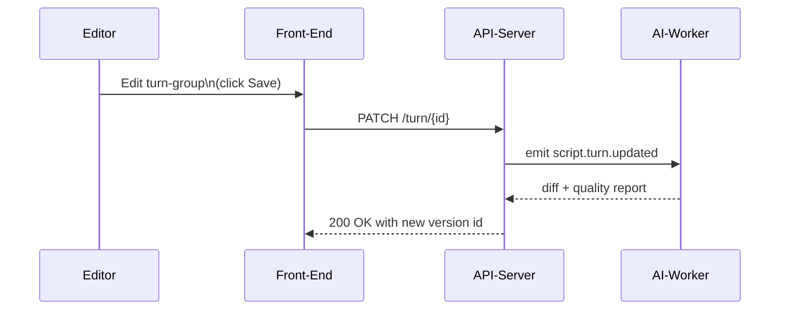

# USER-FLOW FIRST (“Perfect One Flow, Expand”)

## Philosophy

Pick the SINGLE highest-value daily task your psychologists do and optimize it end-to-end; then replicate the pattern to other flows.

**Stage 0** Identify Keystone Flow
    Example: “Editor rewrites a user turn, gets it approved, exports snapshot.”

**Stage 1** Prototype that flow.
    - Consider using AI image generation models as an initial step to create 'visual seeds' for inspiration. These AI-generated visuals can help brainstorm aesthetics and high-level concepts quickly, especially for non-designer teams, before detailed design in Figma or Framer.
    - Develop detailed prototypes in Figma / Framer; user-test with 3 people.

**Stage 2** Build only the components needed for that path:
     - Gold-path canvas subset of nodes for that script.
     - Inline editing → new version.
     - One-click diff & approval.
     - Snapshot export.

**Stage 3** Backfill branching, comments, AI assists, etc., as dictated by next daily flow (e.g., creating RLHF preference pairs).
Great for de-risking human UX adoption; slower to accumulate breadth, but every increment is production-useful.

## Approach

We keep building and executing user flows one by one until the doc `ideation_collab.md` is completed:

**1. Select a keystone flow**
   - Choose the next highest-value daily task (e.g., “rewrite → review → approve”) and freeze scope to *just* the screens, states, and APIs that flow needs.

**2. Spec refinement pass (“pass-2” for that slice)**
   ‑ Extract every UI element, state change, error path.  
   ‑ Add missing micro-details back into `ideation_collab.md` so the doc stays the single source of truth.

**3. Build & test that slice end-to-end**
   ‑ Front-end, API, persistence, a smoke test.  
   ‑ Dog-food it yourself (or with one psychologist) until it's smoother than the current tool.

**4. Implement the into the current workflow to replace the manual workflow for that user flow**
   ‑ Make sure that the users are using it for that function and they don't go back to the old workflow for that user flow.

**5. Repeat with the next flow**
   ‑ Prioritize by user pain or downstream dependency—branching, diff review, snapshot export, etc.

**Advantages of this "flow-at-a-time" loop**
    - Keeps momentum: you always have a shippable improvement.  
    - Continuously hardens the spec: every build uncovers edge-cases you'd never spot on paper.  
    - Reduces rework: later flows reuse tested patterns/components from earlier ones.  
    - Gives you checkpoints to reassess priorities or slot in AI-assist spikes without derailing everything.

Iterate through user flows, each iteration upgrading both the running software and the living spec, until the entire doc's backlog is green.

<!--
============================================================
Below is the **reference implementation** of the lightweight
"spec-as-you-go" process discussed in the conversation on 2025-05-09.
Additions are wrapped in HTML comments so future maintainers know
WHY this block exists and can quickly locate or update it.
============================================================
-->

---

## 📐 Reference: Lightweight Doc-Along Checklist

> Use this section as a ready-made playbook every time you spin up a **new user flow**. Copy the relevant block into your pull-request description, Notion ticket, or GitHub issue so everyone stays in sync.

### Why this exists
1. **Zero stale paperwork** – You write only what the flow truly needs.
2. **Fast feedback** – Vague spec lines break *today*, not six weeks later.
3. **Pattern re-use** – The first flow becomes boilerplate for the next.
4. **Automatic progress meter** – The moment all flows tick their boxes, `ideation_collab.md` is by definition complete.

### ⏱ 10-minute Checklist (paste into every PR)
```text
☐ Update /docs/user_flows/<flow-name>.md
☐ Add/extend any of:
   – contracts/events/<new_event>.yaml
   – contracts/openapi.yaml
   – jobs/<new_job>.py  (stub with TODOs)
   – docs/observability.md (metric or dashboard entry)
☐ Link the commit back in ideation_collab.md (✅ inline tick)
```

### Step-by-Step Loop
1. **Build the slice**  – Code, tests, UI, data model; whatever the flow needs.
2. **Fill the blanks while context is fresh**  – If you created a Redis event, document its JSON shape in `contracts/events/…`. Any auth edge-case? Append it to `security_compliance.md`. Nightly job? Stub it in `jobs/` and list it in `infra_deployment.md`.
3. **Tick the backlog**  – Mark the corresponding line in `ideation_collab.md` as ✅. That file remains the single source of truth.

### 📄 Flow-Doc Template (`/docs/user_flows/<flow-name>.md`)
> Save this as a new markdown file in `/docs/user_flows/` for each flow.

```markdown
# <Flow Name>  (e.g., Rewrite → Review → Snapshot)

## Purpose
Brief sentence on *why* this flow matters and how you'll measure success.

## Actors
Editor, Reviewer, AI-Worker, Cron Job, etc.

## Sequence Diagram

```

## API / Event Touchpoints
- **API**: PATCH /turn/{id}   *(added `blueprint_step` field)*
- **Event**: `script.turn.updated` (schema **v2**)

## Open Questions / Edge Cases
🔸 _List anything still fuzzy here._

## Done-When Checklist
- [ ] Scenario passes E2E in **staging**
- [ ] All docs above merged
- [ ] Corresponding item in `ideation_collab.md` marked ✅
```

### CI Guard-Rails
- **Schema-exists lint** – CI fails if a new event name appears in code without a matching schema file in `contracts/events/`.
- **Doc-update reminder** – A git hook prompts: _"Did you update the docs/observability.md?"_ whenever `jobs/` or `events/` change.

### Tips for Keeping the Loop Tight
• **Co-locate spec & code** in the same PR so reviewers see both at once.  
• **Auto-link PRs** back to the flow doc using GitHub's `closes` syntax (`closes #123`).  
• **Reuse snippets** – Turn this whole block into a GitHub Issue template or a Notion snippet to avoid copy-paste errors.

---

<!-- End of reference block -->